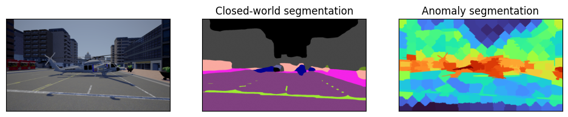

# Street anomaly segmentation

## Introduction

Project for the Machine Learning for Computer Vision course at the University of Bologna (A.Y. 2024-2025). 

## Description

Open-world semantic segmentation (semantic segmentation + out-of-distribution detection) on the StreetHazards dataset.

